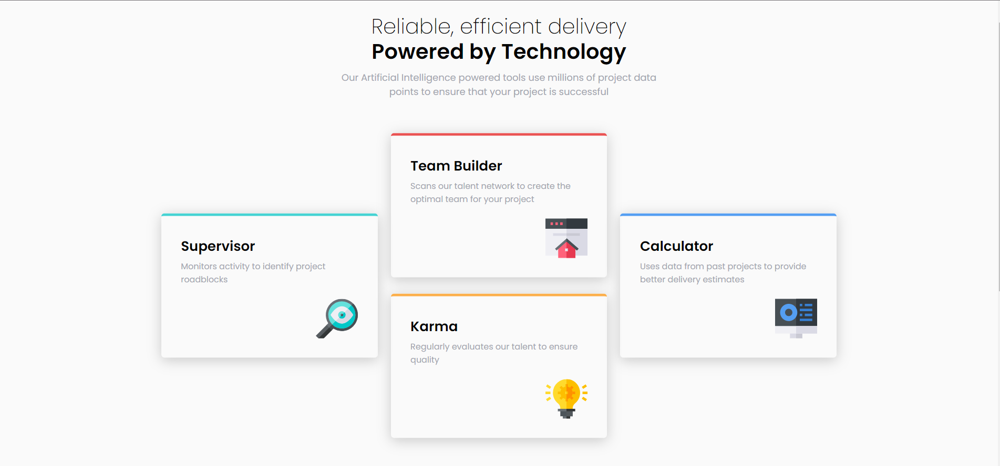
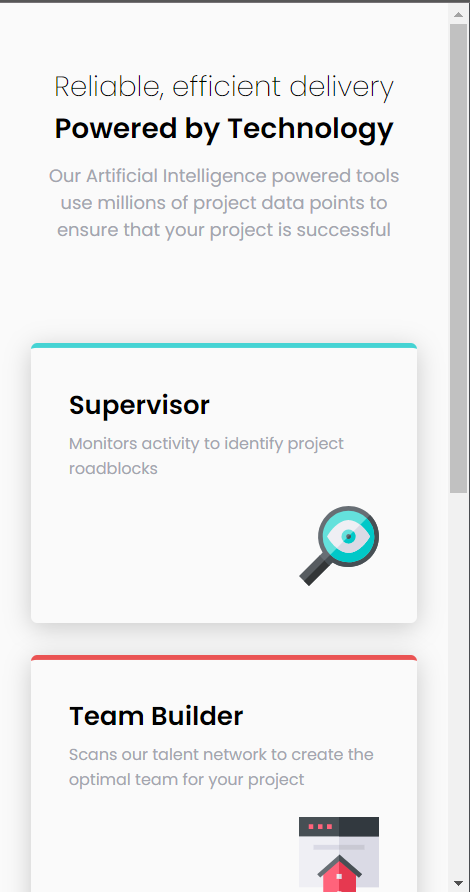

# Frontend Mentor - Four card feature section solution

This is a solution to the [Four card feature section challenge on Frontend Mentor](https://www.frontendmentor.io/challenges/four-card-feature-section-weK1eFYK). Frontend Mentor challenges help you improve your coding skills by building realistic projects.

## Table of contents

-   [Overview](#overview)
    -   [The challenge](#the-challenge)
    -   [Screenshot](#screenshot)
    -   [Links](#links)
-   [My process](#my-process)
    -   [Built with](#built-with)
    -   [What I learned](#what-i-learned)
-   [Author](#author)

## Overview

### The challenge

Users should be able to:

-   View the optimal layout for the site depending on their device's screen size

### Screenshot




### Links

-   Solution URL: [Add solution URL here](https://your-solution-url.com)
-   Live Site URL: [Add live site URL here](https://your-live-site-url.com)

## My process

### Built with

-   Semantic HTML5 markup
-   CSS custom properties
-   Flexbox
-   CSS Grid
-   Mobile-first workflow

### What I learned

Ok, so in this challenge I really enjoyed the Grid aspect of it. Especially this code right here:

```css
.tools-container {
	display: grid;
	width: 70%;
	margin-inline: auto;
	grid-template-columns: repeat(3, 1fr);
	grid-template-rows: repeat(4, 1fr);
	column-gap: 20px;
	justify-content: center;
	transform: translateY(-70px);
}

.tool-card:nth-child(1) {
	grid-column: 1 / 2;
	grid-row: 2/3;
}

.tool-card:nth-child(2) {
	grid-column: 2 / 3;
	grid-row: 1/3;
	align-self: center;
}

.tool-card:nth-child(3) {
	grid-column: 2 / 3;
	grid-row: 2/4;
	align-self: center;
}

.tool-card:nth-child(4) {
	grid-column: 3 / 4;
	grid-row: 2/3;
}
```

## Author

-   Website - [João P. Kiyoshi](https://joaopkiyoshi.netlify.app/)
-   Frontend Mentor - [@jpkiyoshi](https://www.frontendmentor.io/profile/jpkiyoshi)
-   Twitter - [@jpkiyoshi](https://twitter.com/jpkiyoshi)
